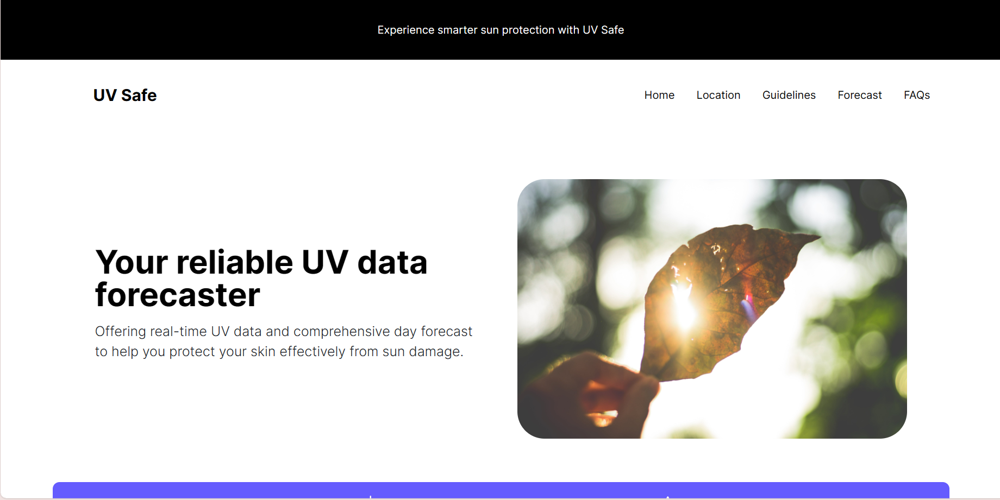
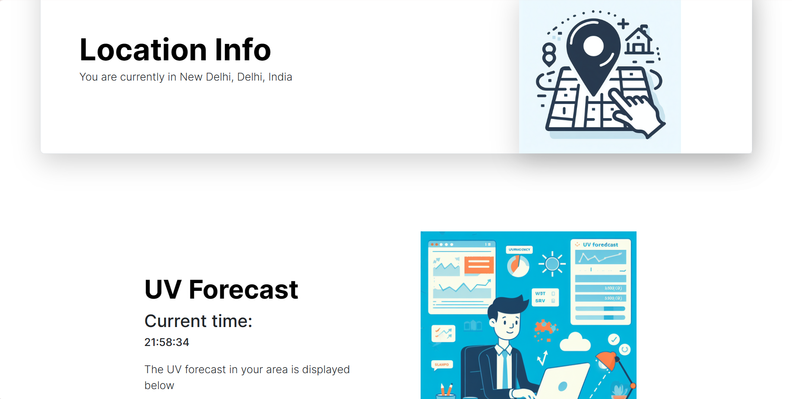
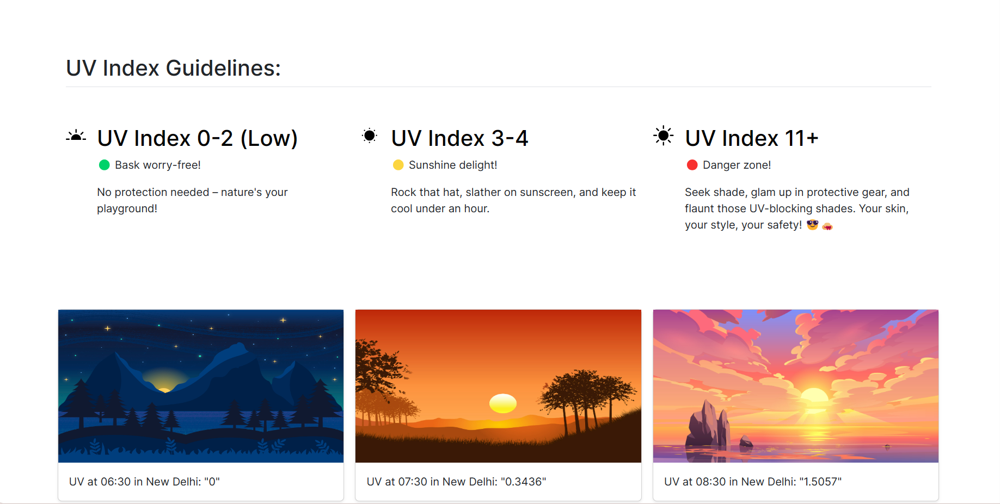
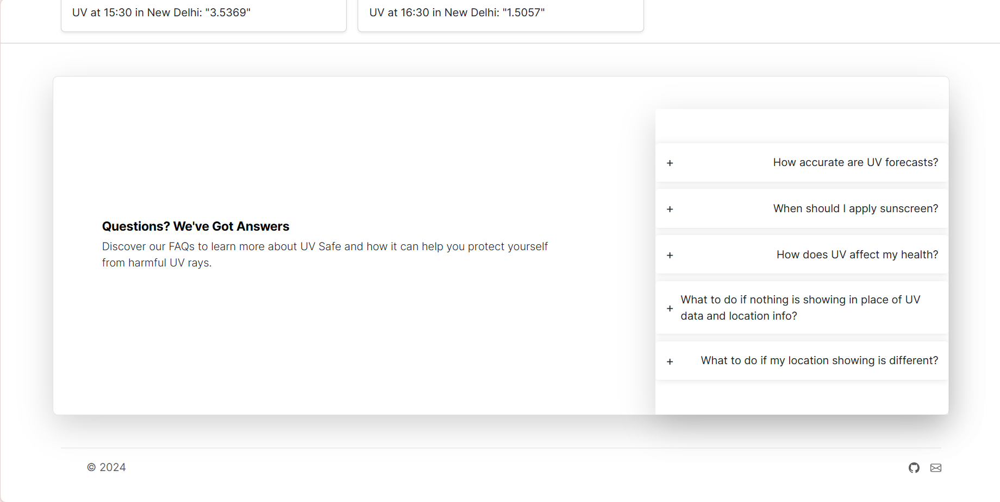

# UV Safe

**Description**

This Node.js web application fetches UV index data and location information for a given latitude and longitude. It utilizes the OpenCageData API for geocoding and the Open UV API for UV data retrieval. The retrieved information is then displayed on an EJS template. The goal is to help users take preventive measures to protect themselves from harmful UV rays.
  
  
**Key Features**

- Retrieves UV index data for the next 11 hours.
- Displays location details (city, state, country).
- Converts UTC timestamps to India Standard Time (IST) for user convenience.
- User-friendly interface built with EJS templates.

**Prerequisites**

- Node.js and npm (or yarn) installed on your system.
- An OpenCageData API key ([https://opencagedata.com/](https://opencagedata.com/))
- An Open UV API key ([https://www.openuv.io/index.html](https://www.openuv.io/index.html))

**Installation**

1. Clone this repository:

   ```bash
   git clone https://github.com/your-username/your-project-name.git
   ```

2. Navigate to the project directory:

   ```bash
   cd your-project-name
   ```

3. Install dependencies:

   ```bash
   npm install
   ```

**Configuration**

1. Create a `.env` file in the project root directory.
2. Add the following environment variables to the `.env` file, replacing the placeholders with your actual API keys:

   ```
   OPEN_CAGE_KEY=your_opencagedata_api_key
   OPEN_UV_KEY=your_openuv_api_key
   ```

**Running the Application**

1. Start the development server:

   ```bash
   npm start
   ```

2. Open http://localhost:3000 in your web browser.

**Usage**

1. Enter valid latitude and longitude values in the input fields on the web page.
2. Click the "Submit" button.

The application will retrieve the UV index data and location information for the specified coordinates and display it on the page.

**Screenshots**

* **Home Page:**  
* **Location fetching:** 
* * **Guidelines:** 
* * *QnA:** 

**Contributing**

We welcome contributions to this project! Feel free to fork the repository, make changes, and submit a pull request. Before contributing, please review the following guidelines:

- Adhere to the existing code style and formatting.
- Include clear and concise comments in your code.
- Write unit tests for your changes.
- Ensure your code passes all existing tests before submitting a pull request.


**Additional Notes**

- Error handling is included to gracefully handle invalid user input or API errors.
- The code is well-structured and uses promises for asynchronous operations.
- Feel free to customize the application further by adding features or changing the UI design.

